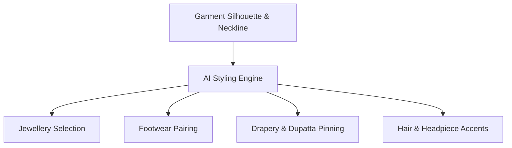

# Styling Recommendations

Great catalog photography requires thoughtful styling that elevates the garment without overshadowing it. Youthnic AI Studio's **Styling Engine** automatically analyzes your garment's neckline, embroidery colors, and silhouette to recommend harmonious jewelry, footwear, and drapery.

---

## Intelligent Jewellery Coordination

The styling engine inspects the detected neckline geometry and embellishment finish:

[SCREENSHOT REQUIRED:
Page: Studio (/studio)
Exact State: Jewellery styling panel open with AI-recommended options checked and preview thumbnails shown.
Exact UI Section: Styling Recommendations card → Jewellery sub-tab.
Recommended Crop: 650x450
Recommended Dimensions: 650x450
Filename: studio-styling-jewellery-options.webp]

<Tabs>
  <Tab title="Deep Necklines (Sweetheart / Plunging V)">
    The AI recommends statement chokers or layered multi-strand necklaces (e.g. *Polki choker with emerald bead drops*) to balance open collarbones without touching the garment border.
  </Tab>
  <Tab title="Heavy Yoke / High Neck (Mandarin / Closed Round)">
    The AI automatically disables heavy necklaces to prevent covering intricate chest embroidery. Instead, it pairs *statement chaandbalis* or *jhumkas* with a matching *maang tikka*.
  </Tab>
  <Tab title="Boat Neck / Off-Shoulder">
    The AI suggests *sleek shoulder-duster earrings* and *delicate hathphool* (hand harnesses) to emphasize shoulder lines and arm drapes.
  </Tab>
</Tabs>

---

## Footwear Pairings

Avoid common AI image glitches like missing shoes or awkward bare feet. Youthnic allows explicit footwear assignment:

| Footwear Category | Styles Available | Recommended Pairings |
| :--- | :--- | :--- |
| **Traditional Ethnic** | Embellished Mojaris, Punjabi Juttis, Kolhapuri Wedges | Anarkalis, Salwar Suits, Kurtis, Sharara Sets |
| **Bridal & Festive** | Metallic Block Heels, Peep-Toe Bridal Wedges, Zari Platforms | Heavy Lehengas, Banarasi Sarees |
| **Contemporary Western** | Minimalist Ankle-Strap Stilettos, Mules, Nude Pumps | Gowns, Co-ord Sets, Indo-Western Fusion |

<Tip>
For floor-sweeping lehengas and gowns, toggle **Concealed Footwear (Floor Sweep)** so the hemline drapes elegantly across the ground without revealing shoe tips.
</Tip>

---

## Dupatta & Drapery Styling

For Indian ethnic sets and sarees, the way the fabric is pinned completely alters the silhouette:

[SCREENSHOT REQUIRED:
Page: Studio (/studio)
Exact State: Dupatta styling selector showing visual diagrams of drape styles (Left Shoulder Pinned, Cascading Open Drape, Arm Cuffs).
Exact UI Section: Dupatta Drapery configuration selector.
Recommended Crop: 600x380
Recommended Dimensions: 600x380
Filename: studio-dupatta-drapery-styles.webp]

<CardGroup cols={2}>
  <Card title="Left Shoulder Pinned" icon="thumbtack">
    Neatly pleated and pinned to the left shoulder, falling straight down front and back. Keeps front chest embroidery completely visible.
  </Card>
  <Card title="Flowing Open Drape" icon="wind">
    Draped loosely across one forearm, letting translucent organza or chiffon float in dynamic editorial motion.
  </Card>
  <Card title="Double Dupatta (Bridal)" icon="layer-group">
    One heavy velvet/silk dupatta pinned across the body, and a sheer lightweight organza dupatta draped gently over the head.
  </Card>
  <Card title="Wrist-to-Wrist Shawl Drape" icon="hand">
    Draped around the back of the arms and looped over the wrists, framing the back and waistline.
  </Card>
</CardGroup>

---

## Next Steps

- Configure the [Five-Pose Catalog Plan](/studio/pose-planning).
- Launch your photoshoot in [Generate Photoshoot](/studio/generate-photoshoot).
