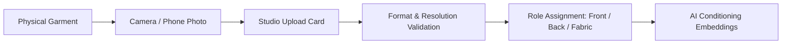

# Upload Product Images

The **Product Photos** panel handles the ingestion and optical pre-processing of your physical garment references. Uploading clear, color-accurate photos is the single most important factor in achieving high-fidelity AI catalog output.

---

## Supported File Formats & Limits

| Parameter | Supported Specifications |
| :--- | :--- |
| **File Formats** | JPEG (`.jpg`, `.jpeg`), PNG (`.png`), WebP (`.webp`) |
| **Max File Size** | 25 MB per image |
| **Recommended Dimensions** | 1500 x 2000 px minimum up to 4096 x 4096 px |
| **Color Space** | sRGB (Standard Web Color Profile) |
| **Total Upload Slots** | Up to 8 reference images per photoshoot |

<Warning>
Do not upload HEIC (Apple Live Photo) or RAW files directly. Convert them to PNG or JPEG before uploading to prevent color profile clipping.
</Warning>

---

## Uploading Your Images

Drag and drop files onto the upload card or click to open your system file browser:

<Frame caption="Live Product Photo Evidence Grid in Youthnic AI Studio — showing 6 garment reference slots and Model Face Reference slot">
  
</Frame>

<Steps>
  <Step title="1. Upload Front (Required)">
    Drop your front-facing reference photo into the primary upload slot. Ensure the entire garment is visible from neckline to hem without cropping.
  </Step>
  <Step title="2. Upload Back (Required)">
    Drop the rear view into the second slot. Captures back neckline cuts, deep-back dori ties, pallu falls, back zippers, and rear embroidery motifs.
  </Step>
  <Step title="3. Upload Fabric / Pattern Detail (Optional)">
    Add an upper-garment embroidery or fabric close-up focusing on weave texture, print sharpness, zari luster, or thread count.
  </Step>
  <Step title="4. Upload Bottom Wear / Farshi (Optional)">
    Upload trousers, palazzos, skirts, farshi lehengas, or dhoti cuts to lock bottoms styling and ensure cohesive full-body silhouette generation.
  </Step>
  <Step title="5. Upload Mannequin / Flat-lay Shot (Optional)">
    Provides dress-form or flat-lay drape evidence to inform how the fabric hangs, folds, and holds volume.
  </Step>
  <Step title="6. Upload Additional Product Photo (Optional)">
    Supplementary angle, sleeve detail, or lining preview to eliminate ambiguous AI inferences.
  </Step>
  <Step title="7. Model Face Look (Optional)">
    Upload a clear face photo reference to maintain consistent face structure, ethnicity, and facial identity across multiple SKU shoots.
  </Step>
</Steps>

---

## Supported Reference Types

Youthnic accepts garment references captured in virtually any practical setting:

<Tabs>
  <Tab title="Ghost Mannequin / Dress Form">
    **Recommended for best symmetry.** Shows natural garment volume, hollow neckline depth, and hemline drop without model interference.
  </Tab>
  <Tab title="Flat Lay on White Board">
    Great for tops, shirts, kurtis, and unstitched fabrics. Smooth out wrinkles and ensure lighting is even across both sides.
  </Tab>
  <Tab title="Hanger Shot Against Neutral Wall">
    Acceptable for quick sample shots. Ensure the garment hangs straight and is not bunched on the hanger clips.
  </Tab>
  <Tab title="Rough Studio Test Shoot">
    If you have an existing basic photo on an in-house model, upload it. The AI can replace the model, face, hair, and set while retaining the garment.
  </Tab>
</Tabs>

---

## Image Pre-Processing & Validation

When an image is dropped into a slot, Youthnic runs immediate client-side and server-side checks:
- **Aspect Ratio Detection**: Detects vertical orientation and warns if an image is flipped horizontally or upside down.
- **Resolution Warning**: Displays an amber warning icon if the image is under 1000px wide.
- **Blur & Motion Detection**: Rejects severely blurred photos that lack fabric thread detail.

[SCREENSHOT REQUIRED:
Page: Studio (/studio)
Exact State: Upload card displaying a low-resolution warning badge with tooltip 'Image resolution under 1000px wide. Output fidelity may be reduced.'
Exact UI Section: Upload tile with amber badge.
Recommended Crop: 400x300
Recommended Dimensions: 400x300
Filename: studio-upload-resolution-warning.webp]

---

## Next Steps

Once your images are uploaded, assign their precise semantic tags:
- [Reference Roles](/studio/reference-roles) explains how to tag front, back, fabric, and saree components.
- [AI Product Analysis](/studio/ai-product-analysis) walks through automated attribute extraction.
